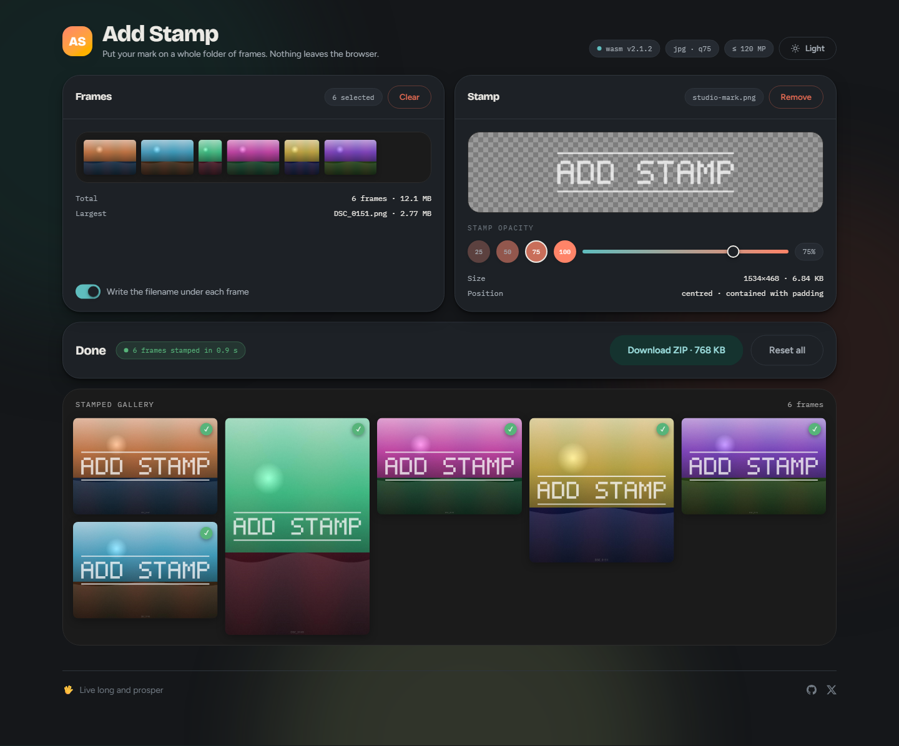
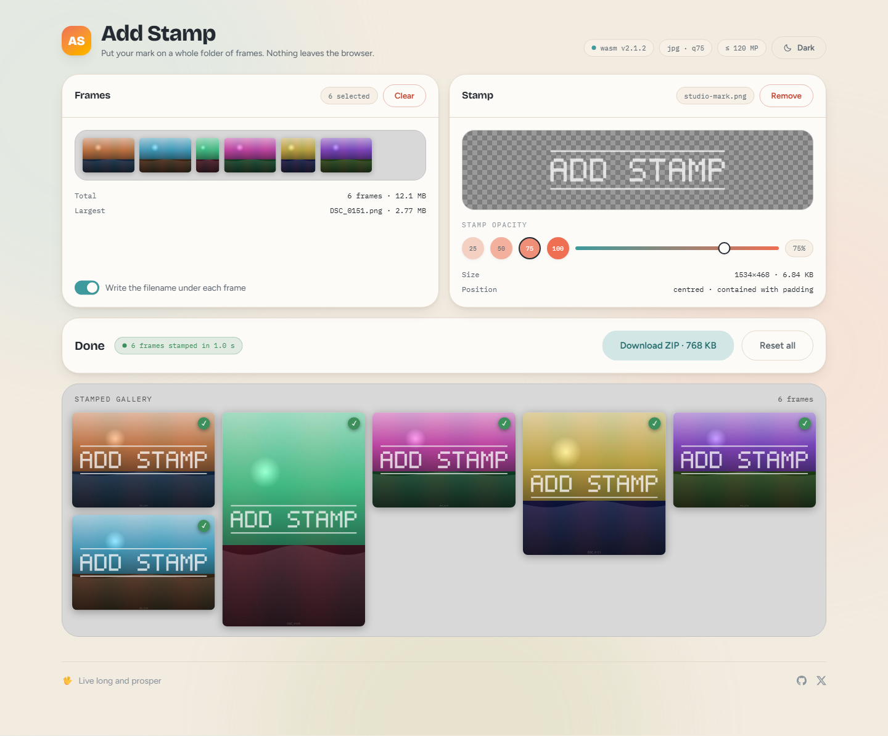

# Add Stamp



Batch watermarking in the browser. Drop in a folder of frames and a PNG mark, and every photo
comes back stamped, captioned with its filename, and zipped — without a single byte leaving
the machine.

The pipeline is a Rust crate compiled to WebAssembly, so decoding, compositing and re-encoding
all happen on the user's own hardware at close to native speed. There is no server, no upload
and no account.

> **📚 WASM development guide**: the Rust crate, its JavaScript API, the option table and the
> build are documented in [README-WASM.md](README-WASM.md).
> Measurements and the open encoder decision live in [docs/PERFORMANCE.md](docs/PERFORMANCE.md).

## What it does

- 🖼️ Batch-stamps a whole selection of frames in one pass, with per-file progress
- 🏷️ Scales a PNG mark to fit each frame — contained, centred, with clear padding
- 🎚️ Stamp opacity from 1 % to 100 %, as four presets or a slider, previewed live
- 📝 Writes each photo's filename along its bottom edge, in an embedded font, optionally
- 🔄 Uprights portrait frames from their EXIF orientation before anything is drawn
- ⚡ Runs the whole pipeline in Rust/WebAssembly — no upload, no server, no account
- 📦 Hands back one ZIP archive, which works in every browser
- 🌗 Light and dark themes, following the OS until you pick one
- 🛡️ Refuses oversized images from their header, so one bad file cannot take down the batch

<details>
<summary>The same screen in the light theme</summary>



</details>

## Quick start

```bash
git clone https://github.com/howbizarre/add-stamp.git
cd add-stamp
npm install
npm run dev:wasm
```

Then open [http://localhost:5654](http://localhost:5654).

`dev:wasm` builds the WebAssembly module and then starts the dev server. It needs Rust and
`wasm-pack` — see [Prerequisites](#prerequisites). Plain `npm run dev` skips the build and
serves whatever is already in `public/wasm/`.

## Prerequisites

| Tool | Version | Install |
| --- | --- | --- |
| Node.js | 22.19+, 24.11+ or 26+ (what Nuxt 4.5 requires) | [nodejs.org](https://nodejs.org/) |
| Rust | pinned in [`wasm/rust-toolchain.toml`](wasm/rust-toolchain.toml); rustup fetches it on first build | [rustup.rs](https://rustup.rs/) |
| wasm-pack | any recent release | `cargo install wasm-pack` |

The toolchain is pinned because the `wasm-bindgen` crate has to match the `wasm-bindgen-cli`
that `wasm-pack` runs. `rustup` reads that file and installs the right `rustc` and the
`wasm32-unknown-unknown` target by itself, so there is nothing to add by hand.

```bash
# Windows (PowerShell)
Invoke-WebRequest -Uri "https://win.rustup.rs" -OutFile "rustup-init.exe"
.\rustup-init.exe

# macOS / Linux
curl --proto '=https' --tlsv1.2 -sSf https://sh.rustup.rs | sh

# then, on any platform
cargo install wasm-pack
```

## Setup

### 1. Install dependencies

```bash
npm install     # or pnpm install / yarn install / bun install
```

### 2. Build the WASM module

```bash
npm run build:wasm     # compile the crate and publish the artifact
npm run copy:wasm      # republish an existing wasm/pkg/ without recompiling
```

The artifact is published to `public/wasm/v<version>/`, where `<version>` is the `version`
field of `package.json`:

- `image_stamper.js`
- `image_stamper_bg.wasm`

The build script fails loudly if either is missing or empty, so a successful
`npm run build:wasm` is itself the check. [README-WASM.md](README-WASM.md#why-the-artifact-is-versioned)
explains why the directory carries a version and when to bump it.

`npm run build` runs `build:wasm` first, so an ordinary build or deploy always ships a current
artifact.

### 3. Start the dev server

```bash
npm run dev
```

The app is served at [http://localhost:5654](http://localhost:5654). It runs with `ssr: false`,
so the page is a static shell and everything happens client-side.

## Using it

1. **Drop frames**, or click the panel to pick them from disk. The strip previews the first
   eight and the gallery below shows every one of them, with dimensions and orientation.
2. **Drop a PNG stamp.** It has to be real PNG data, under 10 MB. The preview sits on a
   checkerboard, because a white mark on a light surround is invisible.
3. **Set the opacity** — presets at 25 / 50 / 75 / 100, or the slider for anything between 1
   and 100. The preview dims with it.
4. **Decide about the caption** with the *Write the filename under each frame* switch, on by
   default.
5. **Apply stamp.** A progress bar names each file as it goes; when it finishes, the gallery
   swaps to the stamped results and the panel reports how long the batch took.
6. **Download ZIP.** One archive, `stamped-images-<timestamp>.zip`, holding a
   `stamped-images/` folder of `<original name>_stamped.jpg`.
7. **Reset all** clears the frames, the stamp, the results and the settings.

### What the stamp actually does to a frame

- **Orientation first.** EXIF `Orientation` is read from the encoded bytes and applied before
  anything is drawn, so a portrait frame off a phone is not stamped sideways.
- **The mark is contained, not tiled or cornered.** It is scaled to the largest size that
  fits inside the frame with 10 px of clear space on every side, then centred. A wide
  wordmark therefore spans the frame; a square mark fills its height.
- **Opacity is applied at composite time**, so a semi-transparent PNG keeps its own alpha as
  well.
- **The caption is the filename**, centred along the bottom edge, at 2.2 % of the frame's
  shorter side (never below 16 px or above 96 px), in `#7d7d7d` at 50 % opacity. It is drawn
  from an embedded Ubuntu-M subset with real kerning, so it renders identically everywhere,
  Cyrillic included.
- **Output is JPEG at quality 75.** Translucent pixels are composited onto white first,
  because JPEG has no alpha channel.

### Formats and limits

| | |
| --- | --- |
| Input frames | JPEG, PNG and WebP — the decoder is built with those three and nothing else |
| Stamp | PNG, up to 10 MB, transparency expected |
| Output | JPEG (what the UI ships) or WebP |
| Size ceiling | 120 megapixels, and 65 535 px on either axis, checked from the header |
| Quality | 75 (JPEG only — the WebP encoder in `image` 0.25 is lossless and ignores it) |

A frame over the ceiling is refused with a message naming its size and the limit, and the
rest of the batch carries on. That check happens before any pixel buffer is allocated, which
is the point of it: a failed allocation in Rust is a panic, and a panic traps the whole
WebAssembly instance.

### What the UI drives, and what it does not

The interface sets four things: `format`, `quality`, `opacity` and `addFilename`. Everything
else — padding, the size budget, the JPEG matte, the resize-filter threshold, the caption's
size, margins and colour — keeps the default compiled into the crate and can be surfaced
later without any change on the Rust side.

The full list, with defaults and meanings, is the option table in
[README-WASM.md](README-WASM.md#options). The TypeScript layer deliberately does not repeat
the numbers, so the two cannot drift apart.

## Scripts

| Script | What it does |
| --- | --- |
| `npm run dev` | Dev server on port 5654 |
| `npm run dev:wasm` | Build the WASM module, then the dev server |
| `npm run build` | Build the WASM module, then the Nuxt app |
| `npm run build:wasm` | Compile the crate and publish to `public/wasm/v<version>/` |
| `npm run copy:wasm` | Republish an existing `wasm/pkg/` without recompiling |
| `npm run clean:wasm` | Remove `wasm/pkg/` and `public/wasm/` |
| `npm test` | The Rust test suite, on the native target |
| `npm run bench:wasm` | Time the pixel helpers on a synthetic 24 MP frame (native) |
| `npm run preview` | Build, then serve the Worker locally with Wrangler |
| `npm run deploy` | Build, then deploy to Cloudflare |
| `npm run generate` | Prerender to static files |
| `npm run cf-typegen` | Regenerate `worker-configuration.d.ts` from the Wrangler config |

## Development workflow

### Changing the Rust code

Vite knows nothing about the runtime `import()` of the artifact, so editing `wasm/` does not
trigger a reload. Rebuild and restart:

```bash
npm run build:wasm && npm run dev     # or just: npm run dev:wasm
```

**Bump `version` in `package.json` whenever the crate changes.** The artifact is served
immutably out of a version-stamped directory, so without a bump a returning browser keeps the
old `.wasm`. Keep `wasm/Cargo.toml`'s version in step, so a deployed binary can be traced back
to a commit.

### Changing the Vue/TypeScript code

Anything under `app/` hot-reloads as usual.

### Testing

```bash
npm test     # 91 tests: the pipeline end to end, EXIF transforms, the subset font's
             # alphabet coverage, blending against a naive reference, option clamping
```

The tests run on the native target rather than in a browser, because constructing a `JsError`
off the wasm target aborts the process — see [README-WASM.md](README-WASM.md#layout-of-the-crate).

## Theming

Light and dark are a set of CSS custom properties in
[`app/assets/css/main.css`](app/assets/css/main.css); only the token values change between
them, and no component knows which theme it is in. Dark mode is class-based — `<html class="dark">`.

The class is set by an inline script in [`nuxt.config.ts`](nuxt.config.ts) before first paint.
With `ssr: false` the shell is a static `index.html`, so without it the app would flash the
light palette on every load for anyone on a dark OS. The app follows the OS, including when
the OS switches while the tab is open, until someone actually presses the toggle; that choice
is then stored per browser under `add-stamp:theme`.

Frames themselves always sit on a hue-free grey mount rather than on the warm page colour,
so the surround cannot shift how their white balance reads.

## Deployment

The app deploys to Cloudflare Workers, using the `cloudflare_module` Nitro preset and the
config in [`wrangler.jsonc`](wrangler.jsonc).

```bash
npm run deploy

# or, in two steps
npm run build
npx wrangler --cwd .output/ deploy
```

Things worth knowing:

1. **The WASM files ride along.** `build:wasm` writes them into `public/`, so `nuxt build`
   copies them into `.output/public/wasm/v<version>/`.
2. **Headers are set in `nuxt.config.ts`.** `routeRules` gives `/wasm/**` the right
   content types and `Cache-Control: public, max-age=31536000, immutable`.
3. **Immutability is safe because the directory is versioned.** The glue JS and its `.wasm`
   move as a pair, so a browser can never combine a cached glue from one deploy with the
   `.wasm` from the next — a wasm-bindgen schema error that is very hard to diagnose in the
   field.
4. **Nothing is written server-side.** Photos are processed in the browser and handed back as
   a ZIP; the Worker only serves static files.

After a deploy, check that both of these resolve, with `<version>` matching `package.json`:

- `https://your-domain.com/wasm/v<version>/image_stamper.js`
- `https://your-domain.com/wasm/v<version>/image_stamper_bg.wasm`

## Troubleshooting

### The WASM build

```bash
rustc --version && cargo --version     # is Rust there?
wasm-pack --version                    # is wasm-pack there?
npm run clean:wasm && npm run build:wasm
```

`wasm-pack: command not found` means `cargo install wasm-pack`. An `error validating input`
from `wasm-opt` means the Binaryen feature list in `wasm/Cargo.toml` is missing something the
current `rustc` emits — add the feature it names.

### "Failed to load WASM module"

`public/wasm/v<version>/` is missing or stale. Run `npm run build:wasm`, and check that
`version` in `package.json` matches the directory name — a bumped version with no rebuild
points the client at a directory that does not exist.

If the browser complains that `applyStamp` is not a function, it is running a stale artifact:
rebuild, then hard-reload.

### Text renders as empty boxes

The embedded font is a subset. It covers Latin-1, Latin Extended-A/B and the full Cyrillic
block; a character outside those ranges has no glyph and renders as `.notdef`. Widen the
ranges and regenerate — the `pyftsubset` command, including the `--legacy-kern` flag that
keeps kerning working, is in the doc comment on `FONT_DATA` in
[`wasm/src/lib.rs`](wasm/src/lib.rs).

To swap the face entirely, drop a TTF into `wasm/src/`, point `FONT_DATA` at it, and rebuild:

```rust
static FONT_DATA: &[u8] = include_bytes!("./YourFont.ttf");
```

Font data is incompressible and dominates the binary, so subset it to the characters your
filenames actually use.

### A frame is rejected

The message names the file's size and the limit it exceeded. Either it is over 120 MP or over
65 535 px on an axis, or it is not JPEG, PNG or WebP — those are the only decoders compiled
in. Convert it, or raise `maxMegapixels` / `maxDimension` in the options.

### The dev server will not start

```bash
node --version               # must satisfy Nuxt 4.5's engines: 22.19+, 24.11+ or 26+
rm -rf node_modules package-lock.json && npm install
```

## Browser support

WebAssembly with 128-bit SIMD is the baseline, which means **Chrome 91+, Firefox 89+ and
Safari 16.4+**. SIMD is enabled in [`wasm/.cargo/config.toml`](wasm/.cargo/config.toml) so LLVM
can vectorise the blending and flattening loops.

Saving is a ZIP download in every browser, so there is no File System Access API dependency
and no browser-specific path to fall back to.

## Project structure

```
add-stamp/
├── app/
│   ├── assets/
│   │   ├── css/main.css          # design tokens, both themes, component classes
│   │   ├── fonts/Ubuntu-M.ttf    # the full face, kept as the source for subsetting
│   │   └── img/                  # README screenshots
│   ├── components/
│   │   ├── AppHeader.vue         # title, wasm version / output / limit chips, theme toggle
│   │   ├── ImageUploader.vue     # frame picker, filmstrip, filename switch
│   │   ├── StampPicker.vue       # PNG picker, checkerboard preview, validation
│   │   ├── OpacityPresets.vue    # opacity swatches plus slider
│   │   └── ImageGallery.vue      # the results, on a hue-free mount
│   ├── composables/
│   │   ├── useImageStamping.ts   # the WASM boundary: options, batching, ZIP
│   │   └── useTheme.ts           # light/dark, stored per browser
│   ├── utils/formatFileSize.ts
│   └── app.vue                   # state for a run, and the status panel
├── wasm/                         # the Rust crate — see README-WASM.md
│   ├── src/
│   │   ├── lib.rs                # options, the pipeline, encoding, size limits
│   │   ├── blend.rs              # alpha compositing
│   │   ├── error.rs              # StampError, converted to JsError at the boundary
│   │   ├── layout.rs             # pure geometry: contain-scale, centring
│   │   ├── orientation.rs        # EXIF orientation
│   │   ├── text.rs               # glyph rasterization on ab_glyph
│   │   └── Ubuntu-M-subset.ttf   # the embedded subset
│   ├── tests/pipeline.rs         # end-to-end tests
│   └── examples/bench.rs         # timings for the hot path
├── scripts/build-wasm.mjs        # builds the crate and publishes the artifact
├── docs/PERFORMANCE.md           # where the time goes, and what could be done about it
├── public/wasm/v<version>/       # the published artifact (generated)
├── nuxt.config.ts                # ssr: false, theme boot script, wasm route rules
└── wrangler.jsonc                # Cloudflare Worker config
```

## Technology stack

- **Frontend**: Nuxt 4 (SPA, `ssr: false`), Vue 3, TypeScript, Tailwind CSS 4
- **Image processing**: Rust compiled to WebAssembly, with `simd128`, and no `unsafe` anywhere
- **Image libraries**: the `image` crate with only `png`, `jpeg` and `webp`; `kamadak-exif`
  for orientation
- **Text rendering**: `ab_glyph`, with per-glyph advances and kerning
- **Archiving**: JSZip
- **Build**: Vite, wasm-pack, a Node publish script
- **Hosting**: Cloudflare Workers via Wrangler

## Contributing

1. Fork the repository
2. Create a feature branch: `git checkout -b feature/your-feature`
3. Make your changes
4. Build and test: `npm test && npm run build:wasm && npm run dev`
5. If you touched `wasm/`, bump `version` in `package.json` and `wasm/Cargo.toml`
6. Commit, push, and open a pull request

## License

MIT — see [LICENSE.md](LICENSE.md).

### Third-party components

- **Ubuntu font**: under the Ubuntu Font Licence, separately from this project's MIT licence —
  see [wasm/src/FONT-LICENSE.md](wasm/src/FONT-LICENSE.md)
- **Rust dependencies**: MIT/Apache-2.0 — see [wasm/Cargo.toml](wasm/Cargo.toml)
- **JavaScript dependencies**: see [package.json](package.json)

## Links

- [Nuxt documentation](https://nuxt.com/docs/getting-started/introduction)
- [Rust documentation](https://doc.rust-lang.org/)
- [wasm-pack documentation](https://rustwasm.github.io/wasm-pack/)
- [Cloudflare Workers documentation](https://developers.cloudflare.com/workers/)
